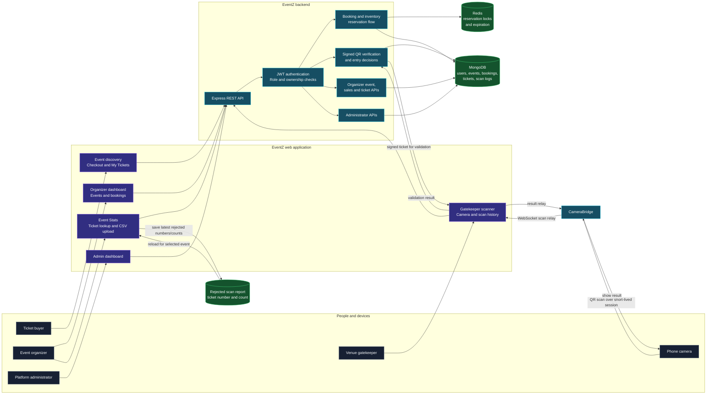
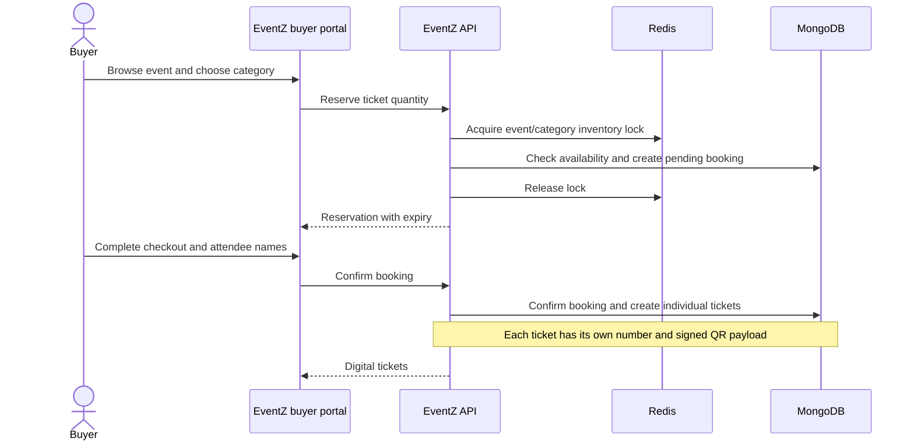
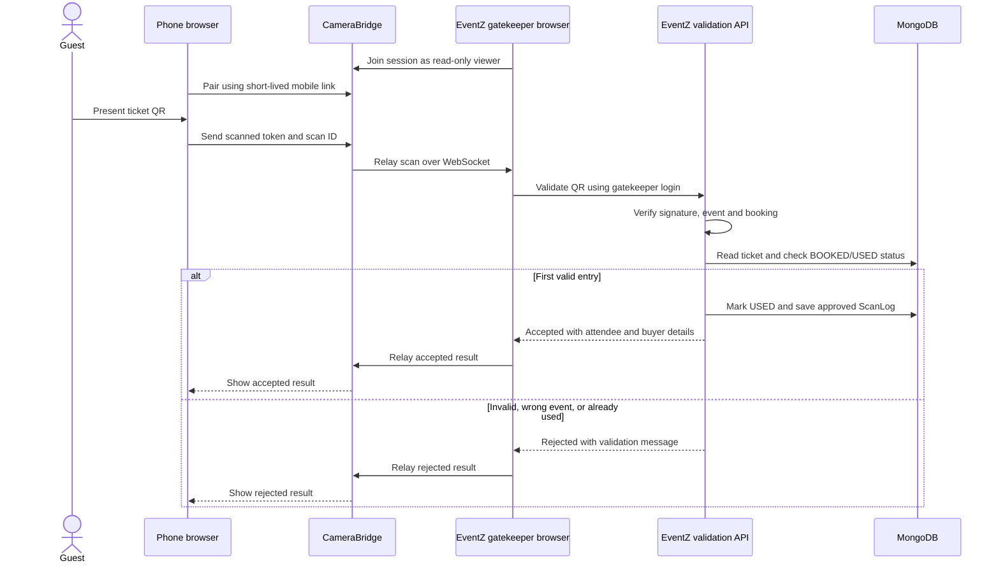
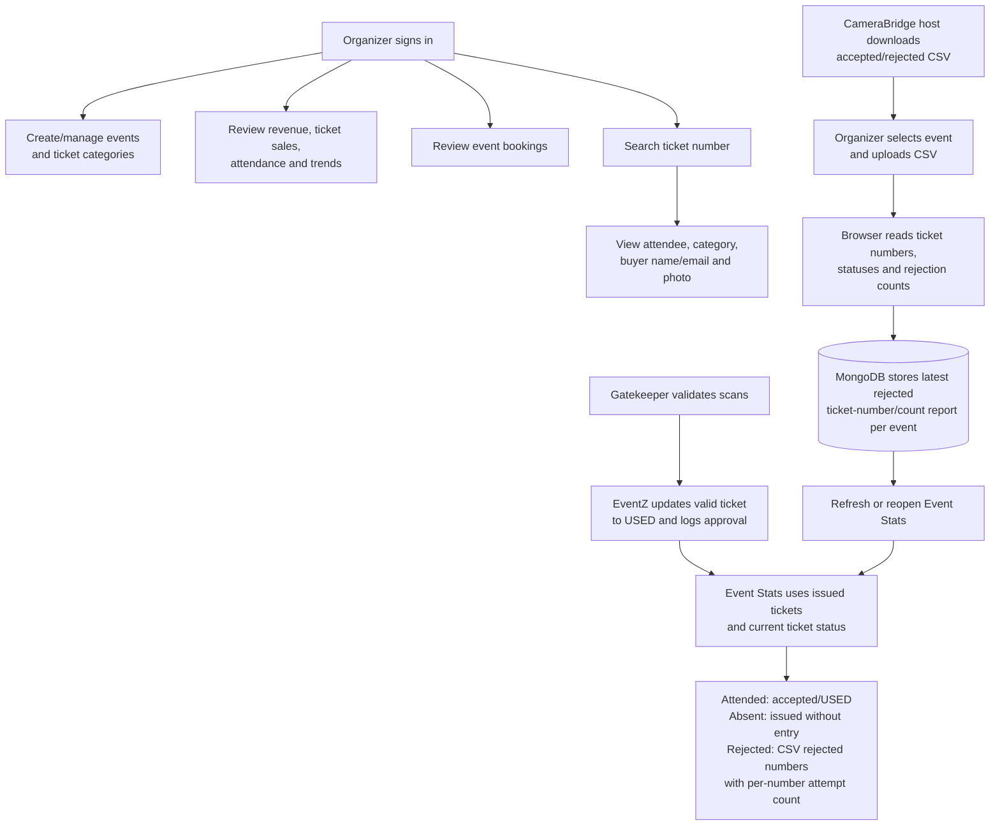

# EventZ

**EventZ is a full-stack event ticketing platform built by Dilip Kumar.** It brings event discovery, ticket reservations, QR-based entry, and organizer analytics together in one role-based application.

The project focuses on a reliable ticket lifecycle: buyers reserve tickets, complete checkout, and receive signed QR tickets; gatekeepers validate those tickets at entry; organizers manage events and review sales and attendance.

## Features

### For ticket buyers

- Browse published events and view event details.
- Reserve tickets while completing checkout.
- Receive individual digital tickets with signed QR codes.
- View booking history and ticket details.

### For event organizers

- Create and manage events and ticket categories.
- Review ticket sales, revenue, inventory, and attendance analytics.
- Search issued tickets by ticket number to view the attendee, buyer contact details, and buyer profile photo when available.
- Upload a CameraBridge scan sheet to review attended, rejected, and absent ticket activity.
- View rejected ticket numbers and rejection counts. The latest imported rejection report is saved per event and remains available after refresh.

### For venue gatekeepers

- Scan QR tickets and validate them against EventZ.
- View attendee, ticket, category, event, and buyer-photo details when available.
- Prevent repeated entry by rejecting tickets that have already been used.
- Review approved scan history.
- Connect a phone camera through the standalone CameraBridge service.

### For administrators

- Review platform activity and manage users, events, and bookings.

## Technology

| Area | Technologies |
| --- | --- |
| Frontend | React, Vite, React Router, Lucide |
| Backend | Node.js, Express |
| Database | MongoDB, Mongoose |
| Reservation coordination | Redis, ioredis |
| Authentication | JWT, HTTP-only cookies, role-based authorization |
| Ticket entry | Signed QR/JWT payloads |
| Mobile scanning bridge | Express, WebSocket (`ws`), browser camera APIs |

## How the complete system works

This diagram maps the implemented user journeys to the application services and the data they use:



### Buyer ticket lifecycle



Reservations expire after five minutes. Redis coordinates concurrent inventory reservations; MongoDB remains the persistent store for bookings and issued tickets.

### Entry validation and optional CameraBridge

**Why CameraBridge is used:** a gatekeeper may want to scan with a phone while continuing to review results in the EventZ gatekeeper page on a laptop. CameraBridge connects those two browsers through an expiring barcode session. It forwards scan data but has no EventZ account credentials, database access, or ticket-approval authority. Keeping validation in EventZ means the normal signed-in gatekeeper session and ticket rules remain in control.



CameraBridge is useful when the phone cannot or should not connect directly to EventZ—for example, the phone is only the camera while EventZ stays open on the gatekeeper's laptop. The browser-to-browser relay avoids putting EventZ credentials on the phone. Use the **mobile link** on the phone and the **viewer link** in EventZ. CameraBridge sessions are short-lived, HTTPS is required for phone camera access, and EventZ still performs every ticket validation.

### Organizer operations and scan-sheet reporting



The Organizer **Event Stats** page compares issued EventZ ticket records with imported scan results. Rejected ticket numbers are shown even if they do not match a ticket record. EventZ persists only the rejected ticket numbers, count, importing organizer, and import time for the selected event—not the CSV or other scan details. A new upload replaces that event's previous rejected report. Multiple rejected rows for one ticket number are counted as multiple attempts.

For CameraBridge-specific setup, API details, and exact Render deployment steps, see [`mobile-cam/README.md`](./mobile-cam/README.md).

## Run locally

### Prerequisites

- Node.js and npm
- MongoDB
- Redis

Start MongoDB and Redis using your operating system's preferred service manager. With Homebrew on macOS:

```bash
brew services start mongodb-community
brew services start redis
```

### Configure the backend

Create `backend/.env` for local development:

```env
NODE_ENV=development
PORT=5001
MONGO_URI=mongodb://127.0.0.1:27017/eventz
REDIS_URI=redis://127.0.0.1:6379
JWT_SECRET=replace-with-a-long-random-local-secret
JWT_EXPIRE=24h
```

Keep `.env` files and real credentials out of version control. For production, use strong secrets and the connection strings for your managed MongoDB and Redis services.

Install dependencies and start the backend:

```bash
cd backend
npm install
npm start
```

The API listens on `http://localhost:5001`. Its status endpoint is `http://localhost:5001/api/status`.

### Configure and start the frontend

Create `frontend/.env`:

```env
VITE_API_BASE_URL=http://localhost:5001/api
```

Then install dependencies and start Vite:

```bash
cd frontend
npm install
npm run dev
```

Open `http://localhost:5173`.

### Local service addresses

| Service | Local address |
| --- | --- |
| EventZ frontend | `http://localhost:5173` |
| EventZ API | `http://localhost:5001/api` |
| MongoDB | `mongodb://127.0.0.1:27017/eventz` |
| Redis | `redis://127.0.0.1:6379` |

## Build and lint

Run these commands from `frontend/`:

```bash
npm run build
npm run lint
```

## Project structure

```text
EventZ/
├── backend/
│   ├── config/       # MongoDB and Redis configuration
│   ├── middleware/   # Authentication, authorization, and errors
│   ├── models/       # MongoDB models
│   ├── routes/       # REST API routes
│   └── server.js     # Express application
├── frontend/
│   └── src/
│       ├── components/
│       ├── context/
│       └── pages/
└── mobile-cam/       # Standalone CameraBridge service and docs
```

## Security notes

- Use HTTPS in production, especially for mobile camera access.
- Keep `JWT_SECRET`, database URLs, and other credentials private.
- Event and ticket APIs enforce authentication, role access, and resource ownership.
- CameraBridge session links are short-lived credentials; share them only with the devices participating in a scan.
- Rejected scan imports are limited to the minimum report data required for organizer review; the original CSV is not uploaded or retained by EventZ.

## Author

**Dilip Kumar**
Computer Science and Engineering
