# EventZ

**EventZ is a full-stack event ticketing platform built by Dilip Kumar.** It brings event discovery, ticket reservations, QR-based entry, and organizer analytics together in one role-based application.

The project focuses on a reliable ticket lifecycle: buyers reserve tickets, complete checkout, and receive signed QR tickets; gatekeepers validate those tickets at entry; organizers manage events and review sales and attendance.

## Features

### For ticket buyers

- Browse published events and view event details.
- Reserve tickets while completing checkout.
- Receive individual digital tickets with signed QR codes.
- View booking history and ticket details.

### For event organizers

- Create and manage events and ticket categories.
- Review ticket sales, revenue, inventory, and attendance analytics.
- Search issued tickets by ticket number to view the attendee, buyer contact details, and buyer profile photo when available.
- Upload a CameraBridge scan sheet to review attended, rejected, and absent ticket activity.
- View rejected ticket numbers and rejection counts. The latest imported rejection report is saved per event and remains available after refresh.

### For venue gatekeepers

- Scan QR tickets and validate them against EventZ.
- View attendee, ticket, category, event, and buyer-photo details when available.
- Prevent repeated entry by rejecting tickets that have already been used.
- Review approved scan history.
- Connect a phone camera through the standalone CameraBridge service.

### For administrators

- Review platform activity and manage users, events, and bookings.

## Technology

| Area | Technologies |
| --- | --- |
| Frontend | React, Vite, React Router, Lucide |
| Backend | Node.js, Express |
| Database | MongoDB, Mongoose |
| Reservation coordination | Redis, ioredis |
| Authentication | JWT, HTTP-only cookies, role-based authorization |
| Ticket entry | Signed QR/JWT payloads |
| Mobile scanning bridge | Express, WebSocket (`ws`), browser camera APIs |

## System architecture and end-to-end workflow

I built EventZ as a role-based ticketing application and integrated my separately deployed **[CameraBridge live service](https://camerabridge.onrender.com)** for phone-camera scanning. The single graph below shows how the user interfaces, EventZ API, CameraBridge, MongoDB, and Redis work together across booking, entry validation, organizer reporting, and administration.

```mermaid
flowchart TB
  subgraph Users["People and devices"]
    Buyer["Buyer"]
    Organizer["Organizer"]
    Gatekeeper["Gatekeeper"]
    Admin["Administrator"]
    Phone["Phone camera"]
  end

  subgraph Frontend["EventZ React application"]
    BuyerPage["Browse events<br/>Checkout<br/>My Tickets"]
    OrganizerPage["Create/manage events<br/>Bookings and analytics"]
    StatsPage["Event Stats<br/>Ticket lookup and scan-sheet import"]
    GatePage["Ticket scanner<br/>Validation result and scan history"]
    AdminPage["Platform management"]
  end

  subgraph Backend["EventZ Express API"]
    Auth["JWT session<br/>Role authorization<br/>Event ownership checks"]
    Booking["Booking service<br/>Availability and checkout"]
    Validation["Ticket validation<br/>Signature, event and booking checks"]
    OrganizerAPI["Organizer APIs<br/>Tickets, analytics and reports"]
    AdminAPI["Admin APIs"]
  end

  subgraph Bridge["My separate CameraBridge service<br/>camerabridge.onrender.com"]
    Pair["Short-lived session<br/>Phone pairing + read-only viewer"]
    Relay["WebSocket scan/result relay<br/>No ticket approval authority"]
  end

  Redis[("Redis<br/>Temporary reservations<br/>Inventory coordination")]
  Mongo[("MongoDB<br/>Users, events, bookings, tickets,<br/>approved scan logs and RejectedScanReport")]

  Buyer --> BuyerPage
  Organizer --> OrganizerPage
  Organizer --> StatsPage
  Gatekeeper --> GatePage
  Admin --> AdminPage

  BuyerPage -->|"Browse, reserve and checkout"| Auth
  Auth --> Booking
  Booking -->|"Lock, check and release inventory"| Redis
  Booking -->|"Save booking; issue individual<br/>signed QR tickets"| Mongo
  Mongo -->|"Tickets and QR data"| BuyerPage

  OrganizerPage -->|"Manage events, view sales"| Auth
  StatsPage -->|"Load organizer-owned event tickets"| Auth
  Auth --> OrganizerAPI
  OrganizerAPI <-->|"Events, categories, bookings,<br/>revenue and ticket-holder data"| Mongo
  StatsPage -->|"Search ticket number;<br/>show attendee and buyer details/photo"| OrganizerAPI
  StatsPage -->|"Upload CSV; submit rejected<br/>ticket numbers and per-number counts"| Auth
  OrganizerAPI -->|"Save latest event-scoped rejection report"| Mongo
  Mongo -->|"Reload saved report after refresh"| OrganizerAPI
  OrganizerAPI -->|"Return ticket data and saved report"| StatsPage
  OrganizerAPI -->|"Return issued-ticket status for attendance view"| StatsPage

  AdminPage --> Auth
  Auth --> AdminAPI
  AdminAPI <--> Mongo

  Phone -->|"Pair with temporary mobile link"| Pair
  GatePage -->|"Join same session with viewer link"| Pair
  Pair --> Relay
  Phone -->|"Scan QR; send value + scan ID"| Relay
  Relay -->|"WebSocket scan event"| GatePage
  GatePage -->|"Submit signed QR using<br/>gatekeeper's EventZ login"| Auth
  Auth --> Validation
  Validation <-->|"Read ticket and booking;<br/>mark valid ticket USED;<br/>record approved entry"| Mongo
  Validation -->|"Accepted or rejected result<br/>with matching scan ID"| GatePage
  GatePage -->|"Relay validation result"| Relay
  Relay -->|"Display scan result"| Phone

  classDef person fill:#172033,stroke:#64748b,color:#f8fafc;
  classDef ui fill:#312e81,stroke:#8b5cf6,color:#fff;
  classDef app fill:#164e63,stroke:#22d3ee,color:#fff;
  classDef storage fill:#14532d,stroke:#4ade80,color:#fff;
  class Buyer,Organizer,Gatekeeper,Admin,Phone person;
  class BuyerPage,OrganizerPage,StatsPage,GatePage,AdminPage ui;
  class Auth,Booking,Validation,OrganizerAPI,AdminAPI,Pair,Relay app;
  class Redis,Mongo storage;
```



### How EventZ works

**Ticket booking:** A buyer selects an event and ticket quantity. EventZ coordinates inventory with a Redis lock, stores a temporary reservation, and releases the lock. The reservation expires after five minutes if checkout is not completed. On checkout, EventZ confirms the booking and creates a separate ticket for each attendee, each with its own ticket number and signed QR payload. MongoDB is the persistent source for bookings and tickets.

**Ticket entry:** The EventZ gatekeeper page submits a scanned ticket using the signed-in gatekeeper's session. EventZ verifies the QR signature, event, booking, and ticket status. For first valid entry, EventZ marks the ticket `USED` and records an approved scan. Invalid, wrong-event, or already-used tickets are rejected. The phone-scanning relay never makes this decision.

**Organizer and administrator tools:** Organizers manage their own events and categories, review booking and revenue metrics, look up a ticket number, and view attendee and buyer details, including a profile photo when available. Event ownership is checked by the API. Administrators use separate protected tools to manage platform activity.

### Why I use CameraBridge as another service

I made **[CameraBridge](https://camerabridge.onrender.com)** as an independent service so a phone can act as the camera while the gatekeeper keeps EventZ open on a laptop. This gave me a real example of integrating a service I built with another application, rather than placing every capability in one codebase.

CameraBridge handles the device connection: it pairs a phone and an EventZ browser through a short-lived session and relays scan events and results over WebSocket. The phone uses the mobile link; EventZ uses the read-only viewer link. The EventZ browser acts as the adapter: it receives the scan, calls EventZ with the gatekeeper's existing login, then sends EventZ's decision back through the bridge. The scan ID correlates each result with its scan.

This separation lets another application use CameraBridge's generic session and relay contract with its own adapter and validation rules. It also keeps EventZ credentials off the phone and avoids giving CameraBridge access to EventZ's database. A production limitation is that active CameraBridge sessions are held in memory on one service instance: restarts end sessions, and horizontal scaling would require shared session state and connection-aware WebSocket routing. A built-in EventZ camera would be simpler to operate if EventZ were the only consumer, while the separate service is more independently deployable and reusable.

### How Event Stats imports CameraBridge scans

After scanning, the CameraBridge host can download a CSV containing accepted and rejected scan rows. An organizer selects the matching event in **Event Stats** and uploads the CSV. The browser uses accepted ticket results to classify attendance alongside EventZ's `USED` status. It displays issued tickets without an accepted or used status as absent.

EventZ saves the latest rejected ticket numbers and rejection count for each number, together with the importing organizer and import time. The report is event-scoped and reloads after a page refresh; a later upload replaces the previous report for that event. EventZ does **not** save the uploaded CSV or other scan details. Rejected rows remain visible in the report even when they follow an accepted scan or do not match an issued ticket record.

### System-design concepts I practiced

- **Service boundaries:** CameraBridge relays scans; EventZ owns ticket decisions and its business data.
- **Integration contracts:** short-lived session pairing and WebSocket scan/result messages connect independently running applications.
- **Least privilege:** the phone receives a temporary pairing link, while the EventZ gatekeeper browser keeps the authenticated EventZ session.
- **Concurrency control:** Redis locks coordinate temporary ticket inventory reservations.
- **Persistent versus transient state:** MongoDB stores EventZ records and rejection summaries; CameraBridge session connections are temporary and in-memory.
- **Operational trade-offs:** independent deployment and reuse add another service to monitor, and the bridge's in-memory sessions need a distributed design before scaling to multiple instances.

For the live scanning service, its API, and exact Render deployment steps, see the [CameraBridge project guide](./mobile-cam/README.md).

## Run locally

### Prerequisites

- Node.js and npm
- MongoDB
- Redis

Start MongoDB and Redis using your operating system's preferred service manager. With Homebrew on macOS:

```bash
brew services start mongodb-community
brew services start redis
```

### Configure the backend

Create `backend/.env` for local development:

```env
NODE_ENV=development
PORT=5001
MONGO_URI=mongodb://127.0.0.1:27017/eventz
REDIS_URI=redis://127.0.0.1:6379
JWT_SECRET=replace-with-a-long-random-local-secret
JWT_EXPIRE=24h
```

Keep `.env` files and real credentials out of version control. For production, use strong secrets and the connection strings for your managed MongoDB and Redis services.

Install dependencies and start the backend:

```bash
cd backend
npm install
npm start
```

The API listens on `http://localhost:5001`. Its status endpoint is `http://localhost:5001/api/status`.

### Configure and start the frontend

Create `frontend/.env`:

```env
VITE_API_BASE_URL=http://localhost:5001/api
```

Then install dependencies and start Vite:

```bash
cd frontend
npm install
npm run dev
```

Open `http://localhost:5173`.

### Local service addresses

| Service | Local address |
| --- | --- |
| EventZ frontend | `http://localhost:5173` |
| EventZ API | `http://localhost:5001/api` |
| MongoDB | `mongodb://127.0.0.1:27017/eventz` |
| Redis | `redis://127.0.0.1:6379` |

## Build and lint

Run these commands from `frontend/`:

```bash
npm run build
npm run lint
```

## Project structure

```text
EventZ/
├── backend/
│   ├── config/       # MongoDB and Redis configuration
│   ├── middleware/   # Authentication, authorization, and errors
│   ├── models/       # MongoDB models
│   ├── routes/       # REST API routes
│   └── server.js     # Express application
├── frontend/
│   └── src/
│       ├── components/
│       ├── context/
│       └── pages/
└── mobile-cam/       # Standalone CameraBridge service and docs
```

## Security notes

- Use HTTPS in production, especially for mobile camera access.
- Keep `JWT_SECRET`, database URLs, and other credentials private.
- Event and ticket APIs enforce authentication, role access, and resource ownership.
- CameraBridge session links are short-lived credentials; share them only with the devices participating in a scan.
- Rejected scan imports are limited to the minimum report data required for organizer review; the original CSV is not uploaded or retained by EventZ.

## Author

**Dilip Kumar**
Computer Science and Engineering
